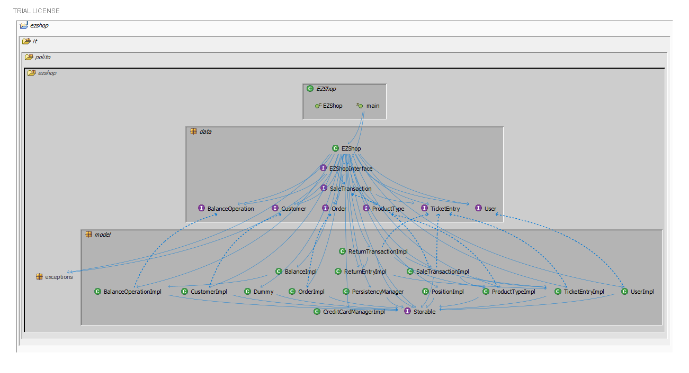
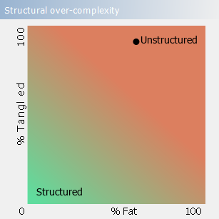
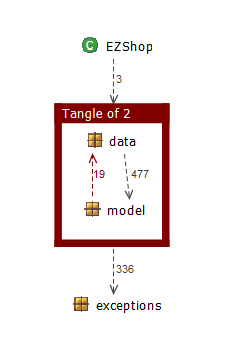

# Design assessment


```
<The goal of this document is to analyse the structure of your project, compare it with the design delivered
on April 30, discuss whether the design could be improved>
```

# Levelized structure map
```
<Applying Structure 101 to your project, version to be delivered on june 4, produce the Levelized structure map,
with all elements explosed, all dependencies, NO tangles; and report it here as a picture>
```


# Structural over complexity chart
```
<Applying Structure 101 to your project, version to be delivered on june 4, produce the structural over complexity chart; and report it here as a picture>
```



# Size metrics

```
<Report here the metrics about the size of your project, collected using Structure 101>
```


| Metric                                    | Measure |
| ----------------------------------------- | ------- |
| Packages                                  | 6       |
| Classes (outer)                           | 44      |
| Classes (all)                             | 44      |
| NI (number of bytecode instructions)      | 9163    |
| LOC (non comment non blank lines of code) | 3940    |


# Items with XS

```
<Report here information about code tangles and fat packages>
```

| Item                                                         | Tangled | Fat  | Size | XS   |
| ------------------------------------------------------------ | ------- | ---- | ---- | ---- |
| ezshop.it.polito.ezshop.data.EZShop                          |         | 280  | 5928 | 3387 |
| ezshop.it.polito.ezshop.data.EZShop.loadAll():boolean        |         | 44   | 846  | 557  |
| ezshop.it.polito.ezshop                                      | 2%      | 4    | 9163 | 208  |
| ezshop.it.polito.ezshop.data.EZShop.deleteReturnTransaction(java.lang.Integer):boolean |         | 16   | 245  | 15   |
| ezshop.it.polito.ezshop.data.EZShop.endReturnTransaction(java.lang.Integer, boolean):boolean |         | 16   | 242  | 15   |
| ezshop.it.polito.ezshop.data.EZShop.returnProduct(java.lang.Integer, java.lang.String, int):boolean |         | 16   | 206  | 12   |


# Package level tangles

```
<Report screen captures of the package-level tangles by opening the items in the "composition perspective" 
(double click on the tangle from the Views->Complexity page)>
```


# Summary analysis
```
<Discuss here main differences of the current structure of your project vs the design delivered on April 30>
<Discuss if the current structure shows weaknesses that should be fixed>
```

## Changes

Our previous design was not aware of some implementation details (the interfaces of the data packege, the persistency layer etc...).
Therefore, with respect to the design document of April 30, we added the suffix "Impl" to all our classes in order to distinguish them from the interfaces and applied the following changes/additions to them:

<h3>CreditCardManagerImpl</h3>

Removed addCard and removeCard as the card are not added or deleted in the final application or in the mockups. Mockup cards are stored in a file that is read by the class whenever the credit card system is supposed to perform a banking operation.

<h3>CustomerImpl</h3>

Added a constructor to rebuild an instance based on a line of a CSV file.

### PersistencyManager

This class was added together with the Storable interface in order to implement persistency. It contains the methods
to store, update and delete an object that implements Storable as well as a method to reset the corresponding csv file

### TicketEntryImpl

This class was added to the design since since there was an interface for it in the data package.

### ReturnEntryImpl

This class was added to mirror the TicketEntryImpl role in ReturnTransactions.

### SaleTransactionImpl

removed some unnecessary fields, added some methods to make the ezshop class tasks easier (applyReturn, undoReturn, etc...),. Additionally some changes to the names of some methods/fields were made.
<br/> Additionally, the internal map was changed into a Map<Integer, TicketentryImpl>

### ReturnTransactionImpl

Roughly the same changes as SaleTransactionImpl, except that the internal map is a Map<Integer, ReturnEntryImpl>

### UserImpl

Removed the method checkPassword() and added the method checkRole().

### OrderImpl

The name of the attribute operationId was changed to balanceId. The attribute int state was removed and an attribute String status was added instead.<br/>Additionally, the methods confirmPayment() and recordArrival() were removed.

### PositionImpl

The class was completely redesigned. We removed all the previous attributes and methods and added the method isValid() and the attribute String position.


## Weaknesses

One huge class (EZShop): the API had to be implemented in one class, as a result the EZShop class has dependencies with almost every other part of the project.

Ditching the CSV files for a proper DBMS: querying the necessary information for each operation would be more efficient, more stable (unexpected failure with CSV means that unsaved information is lost) and it would allow us not to store all the data in the main memory at the same time

Some lists (such as customers or customerCards) should be handled by their respective class rather than EZShop.java

Persistency logic at higher level: all persistency is handled directly inside EZShop class, pushing it at a lower level (leaf classes) could have been an improvement


