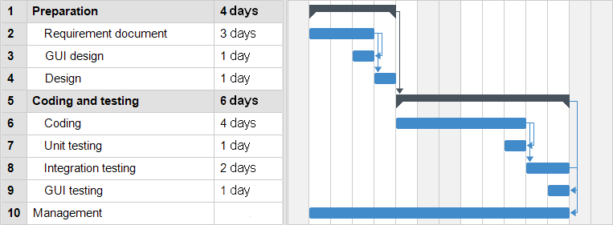

# Project Estimation  
Authors: 
S236053 Andrea    Amato 
S288265 Francesco Blangiardi 
S286645 Matthieu  Brunon 
S287949 Gabriele  Sara 

Date: 30/04/2021
 
Version: 1.0
# Contents
- [Estimate by product decomposition](#estimate-by-product-decomposition)
- [Estimate by activity decomposition ](#estimate-by-activity-decomposition)
# Estimation approach
<Consider the EZGas  project as described in YOUR requirement document, assume that you are going to develop the project INDEPENDENT of the deadlines of the course>
# Estimate by product decomposition
### 
|             | Estimate                        |             
| ----------- | ------------------------------- |  
| NC =  Estimated number of classes to be developed   |  36                            |             
|  A = Estimated average size per class, in LOC       |  60                        | 
| S = Estimated size of project, in LOC (= NC * A) | 2160|
| E = Estimated effort, in person hours (here use productivity 10 LOC per person hour)  |  216                                    |   
| C = Estimated cost, in euro (here use 1 person hour cost = 30 euro) | 6480 | 
| Estimated calendar time, in calendar weeks (Assume team of 4 people, 8 hours per day, 5 days per week ) |    2                |               
# Estimate by activity decomposition
### 
|         Activity name    | Estimated effort (person hours)   |             
| ----------- | ------------------------------- | 
| Requirement Document | 50 |
|GUI|20|
|Design|15|
|Code + Unit Test|55|
|Integration Test + GUI test|40|
|Configuration Management|20|

