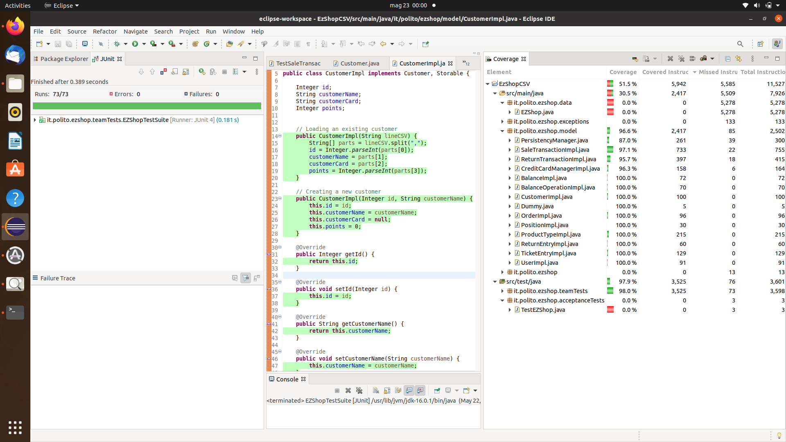

# Unit Testing Documentation

Authors: 
S236053 Andrea    Amato 
S288265 Francesco Blangiardi 
S286645 Matthieu  Brunon 
S287949 Gabriele  Sara 

Date: 18/05/21

Version: 1.0

# Contents

- [Black Box Unit Tests](#black-box-unit-tests)

- [White Box Unit Tests](#white-box-unit-tests)

# Black Box Unit Tests

    <Define here criteria, predicates and the combination of predicates for each function of each class.
    Define test cases to cover all equivalence classes and boundary conditions.
    In the table, report the description of the black box test case and (traceability) the correspondence with the JUnit test case writing the 
    class and method name that contains the test case>
    <JUnit test classes must be in src/test/java/it/polito/ezshop   You find here, and you can use,  class TestEzShops.java that is executed  
    to start tests
    >

## Notes
  Class TicketEntryImpl and ReturnEntryImpl will only be tested in whitebox since they're only comprised of setter and getter methods

## **Class *UserImpl***

  All test cases are in class TestUserImpl

 ### **Class *UserImpl* - method *checkRole***
**Criteria for method *checkRole*:**
	

 - values of roles 
 - value of internal state

**Predicates for method *checkRole*:**

| Criteria | Predicate |
| -------- | --------- |
|   validity of String r : roles       | all valid          |
||some null|
|values of roles | one match in internal role|
||no match in internal role|

**Boundaries**:

| Criteria | Boundary values |
| -------- | --------------- |
|          |                 |
|          |                 |

**Combination of predicates**:

| Validity of roles |value of roles |Valid / Invalid | Description of the test case | JUnit test case |
|-------|-------|-------|-------|-------|
|valid|one match with internal role|valid| user.setRole("Cashier") ... T1("Cashier","asd","sbrambinator") ->return true|testCheckRole|
|''|no match with internal role|valid| user.setRole("Cashier") ... T2("Administrator", "MemeMaster") ->return false|testCheckRole|
|some null|*|invalid|  T3(null,null) ->error|testCheckRole|

## **Class *PositionImpl***

  All test cases are in class TestPositionImpl

 ### **Class *PositionImpl* - method *isValid***
**Criteria for method *isValid*:**
	

 - value of position 

**Predicates for method *isValid*:**

| Criteria | Predicate |
| -------- | --------- |
|   validity of String p : position       | valid          |
||null|

**Boundaries**:

| Criteria | Boundary values |
| -------- | --------------- |
|          |                 |
|          |                 |

**Combination of predicates**:

| Validity of position |Valid / Invalid | Description of the test case | JUnit test case |
|-------|-------|-------|-------|
|valid|valid| T1("1-a-1") ->return true|isValid|
|null|invalid|  T2(null) ->return false|isValid|

 ## **Class *SaleTransactionImpl***

 All test cases are in class TestSaleTransactionImpl

### method SetEntries
**Criteria for method *setEntries*:**
	

 - validity of List<TicketEntry> l
 - validity of the TicketEntry objects e

**Predicates for method *setEntries*:**

| Criteria | Predicate |
| -------- | --------- |
|   Validity of l       | Valid          |
||null|
|validity of TicketEntries e| valid|
||some are null|

**Boundaries**:

| Criteria | Boundary values |
| -------- | --------------- |
|          |                 |
|          |                 |

**Combination of predicates**:

| Validity of l |validity of e |Valid / Invalid | Description of the test case | JUnit test case |
|-------|-------|-------|-------|-------|
|valid|valid|valid| T1(l1={e1,e2})  T2(l2={e3,e4})   ->lists setted to l1 and then resetted to l2 succesfully, return|TestValidSetList|
|''|some are null|invalid| l3 = {null, e1...} T3(l3) ->error|testSomeNullSetList|
|null|*|invalid| T6(null) ->error|testNullSetList||

### method compressEntries

**Criteria for method *compressEntries*:**
	

 - internal state of the Sale's entries

**Predicates for method *compressEntries*:**

| Criteria | Predicate |
| -------- | --------- |
|   state of the Sale's entries | some barCodes have multiple entries |
||each batCode has only one entry|

**Boundaries**:

| Criteria | Boundary values |
| -------- | --------------- |
|          |                 |
|          |                 |

**Combination of predicates**:

| State of entries |Valid / Invalid | Description of the test case | JUnit test case |
|-------|-------|-------|-------|
|duplicated barCodes|valid| setEntries(l1={e1,e1}) T1()  ->return n_collapsed_entries|testPerformedCompressEntries|
|one entry/barCode|valid| l3 = {e1,e2,e3} T3() ->return 0|testNotPerformedCompressEntries|

### method checkState
**Criteria for method *checkState*:**
	

 - values of states 
 - value of internal state

**Predicates for method *checkState*:**

| Criteria | Predicate |
| -------- | --------- |
|value of parameters "states" | one match with internal state|
||no match with internal state|

**Boundaries**:

| Criteria | Boundary values |
| -------- | --------------- |
|          |                 |
|          |                 |

**Combination of predicates**:

| Values of states parameters |Valid / Invalid | Description of the test case | JUnit test case |
|-------|-------|-------|-------|
|one match with internal state|valid| sale.setState(1) ... T1(0,1,2) ->return true|testTrueCheckState|
|no match with internal state|valid| sale.setState(1) ... T1(0,2) ->return false|testFalseCheckState|

### method containsEntry
**Criteria for method *containsEntry*:**
	

 - barCode present

**Predicates for method *containsEntry*:**

| Criteria | Predicate |
| -------- | --------- |
|   barCodePresent      | yes          |
|          |no          |

**Boundaries**:

| Criteria | Boundary values |
| -------- | --------------- |
|          |                 |
|          |                 |

**Combination of predicates**:

| barCode present |Valid / Invalid | Description of the test case | JUnit test case |
|-------|-------|-------|-------|
|yes|valid| String code = "this may be a valid code,null or any string" setEntries(l1={e1={..code..}}) ... T1(code)  ->return true|testTrueCheckState|
|no|valid| String code = "this may be a valid code, null or any string" setEntries(l2={not_code}) ... T2(code)  ->return false|testFalseCheckState|

### method addEntry
**Criteria for method *addEntry*:**
	

 - barCode present
 - validity of prod
 - sign of amount

**Predicates for method *addEntry*:**

| Criteria | Predicate |
| -------- | --------- |
|   barCodePresent      | yes          |
|          |no          |
| validity of prod | valid |
||null|
|sign of amount| (minInt, 0]|
||(0, masInt)|

**Boundaries**:

| Criteria | Boundary values |
| -------- | --------------- |
| sign of amount         |   0, 1             |

**Combination of predicates**:

| barCode present|validity of prod |sign of amount|Valid / Invalid | Description of the test case | JUnit test case |
|-------|-------|-------|-------|-------|-------|
|yes|* | *|invalid| setEntries(l1={e1={p1.getBarCode()}}) ... T1(p1,10) ->return null|testAddEntry|
|*| null| *|invalid| T2(null, 10) ->error|testAddEntry|
|*| * |(minInt, 0]|invalid| T3(p1, -1) ->return null|testAddEntry|
|no|valid|(0,maxInt)|valid| T4(p1,9999) ->return new Entry, state updated|testAddEntry|

### method updateEntry
**Criteria for method *updateEntry(String, Integer)*:**
	

 - barCode present
 - negative final amount

**Predicates for method *updateEntry*:**

| Criteria | Predicate |
| -------- | --------- |
|   barCodePresent      | yes          |
|          |no          |
| negative final amount | yes|
||no|

**Boundaries**:

| Criteria | Boundary values |
| -------- | --------------- |
|          |             |

**Combination of predicates**:

| barCode present|negative final amount|Valid / Invalid | Description of the test case | JUnit test case |
|-------|-------|-------|-------|-------|
|no|* |invalid| setEntries(l1={e1={"a string"}}) ... T1("another string",10) ->error|testUpdateEntry|
|*| yes | invalid| addEntry(p1, 10) ... T2(p1.barCode, -100) ->return null|testUpdateEntry|
|yes|no|valid| setEntries(l1={e1={"a string"}}) ... T1("a string",10) .>return updatedEntry, state is updated|testUpdateEntry|

**Criteria for method *updateEntry(String, Double)*:**
	

 - barCode present
 - value of discount

**Predicates for method *updateEntry*:**

| Criteria | Predicate |
| -------- | --------- |
|   barCodePresent      | yes          |
|          |no          |
| value of discount | inside [0,1)|
||outside [0,1)|

**Boundaries**:

| Criteria | Boundary values |
| -------- | --------------- |
|     value of discount     |   0, 0.9999          |

**Combination of predicates**:

| barCode present|value of discount|Valid / Invalid | Description of the test case | JUnit test case |
|-------|-------|-------|-------|-------|
|no|* |invalid| setEntries(l1={e1={"a string"}}) ... T1("another string",10) ->error|testUpdateEntryDouble|
|*| outside [0,1) | invalid| addEntry(p1, 10) ... T2(p1.barCode, 1.5) ->return null|testUpdateEntryDouble|
|yes|no|valid| setEntries(l1={e1={"a string"}}) ... T1("a string",10) .>return updatedEntry, state is updated|testUpdateEntryDouble|

### method getEntry
**Criteria for method *getEntry*:**
	

 - barCode present

**Predicates for method *getEntry*:**

| Criteria | Predicate |
| -------- | --------- |
|   barCode Present      | yes          |
|          |no          |

**Boundaries**:

| Criteria | Boundary values |
| -------- | --------------- |
|          |                 |
|          |                 |

**Combination of predicates**:

| barCode present |Valid / Invalid | Description of the test case | JUnit test case |
|-------|-------|-------|-------|
|yes|valid| String code = "this may be a valid code,null or any string" setEntries(l1={e1={..code..}}) ... T1(code)  ->return TicketEntry|testGetEntry|
|no|valid| String code = "this may be a valid code, null or any string" setEntries(l2={not_code}) ... T2(code)  ->return null|testGetEntry|

### method computePoints
**Criteria for method *computePoints*:**
	

 - total price

**Predicates for method *computePoints*:**

| Criteria | Predicate |
| -------- | --------- |
|total price| >= 10*n  |
|| < 10*n |

**Boundaries**:

| Criteria | Boundary values |
| -------- | --------------- |
|    total price      |    10 * n - 0.0001, 10 * n             |
|          |                 |

**Combination of predicates**:

total price|Valid / Invalid | Description of the test case | JUnit test case |
|-------|-------|-------|-------|
|>= 10*n|valid| setEntries(l1) ... T1()  ->return n|testComputePoints|
|< 10*n|valid| setEntries(l1) ... T1()  ->return n-1|testComputePoints|

### method applyReturn
**Criteria for method *applyReturn*:**
	
 - all barcodes present
 - validity of List<TicketEntry> returned
 - validity of all entries in returned
 - all final amounts positive

**Predicates for method *applyReturn*:**

| Criteria | Predicate |
| -------- | --------- |
|all barcodes present| yes|
||no|
|validity of returned | valid|
||null|
|validity of entries | all valid|
||some null|
||some have negative amount|
| all final amounts positive |yes|
||no|

**Boundaries**:

| Criteria | Boundary values |
| -------- | --------------- |
|          |                 |
|          |                 |

**Combination of predicates**:

|all barcodes present|validity of returned|validity of entries|all final amounts positive|Valid / Invalid | Description of the test case | JUnit test case |
|-------|-------|-------|-------|-------|-------|-------|
|no | * | * | * | invalid |  setEntries(l1) l1.addSomething() ... T1(l1) ->error|testInvalidApplyReturn|
|* | * | * | no |invalid| e1 = {barcode, 20} addEntry(e1.barcode,10) addEntry(...) ... T2(l2={e1}) ->return false|testInvalidApplyReturn|
|*| *| some null| *|invalid| T3(l1={null,e1}) ->error|testInvalidApplyReturn|
|*| *| some with negative amount| *|invalid| e1 ={..amount : -5..} T2b(l1={e1,e2}) ->return false|testInvalidApplyReturn|
|*| null| * | * |invalid| T4(null) ->return false|testInvalidApplyReturn|
|yes | valid | all valid| yes | valid | setEntries(l1) l1.removeSomething() ... T5(l1) ->return true|testValidApplyReturn|

### method undoReturn
**Criteria for method *undoReturn*:**
	

 - validity of List<TicketEntry> returned
 - validity of all entries in returned
 - all final amounts positive

**Predicates for method *undoReturn*:**

| Criteria | Predicate |
| -------- | --------- |
|validity of returned | valid|
||null|
|validity of entries | all valid|
||some null|
||some with negative amount|

**Boundaries**:

| Criteria | Boundary values |
| -------- | --------------- |
|          |                 |
|          |                 |

**Combination of predicates**:

validity of returned|validity of entries|Valid / Invalid | Description of the test case | JUnit test case |
|-------|-------|-------|-------|-------|
| null | * |invalid| T1(null) ->error|testInvalidUndoReturn|
| *| some null|invalid| T2(l1={null,e1}) ->error|testInvalidUndoReturn|
| *| some with negative amount|invalid| e1 = {..amount: -5...} T2b(l1={e1,e2}) ->return false|testInvalidUndoReturn|
|valid | all valid | valid| setEntries(l1) l1.removeSomething() applyReturn(l1) ... T3(l1) ->return true|testValidUndoReturn|

## **Class *ReturnTransactionImpl***
  All test cases are in class TestReturnTransactionImpl
 This class is very similar to SaleTransactionImpl
 BB test was executed accordingly, WB will still achieve > 90% coverage

### method addEntry
**Criteria for method *addEntry*:**
	

 - barCode present
 - validity of prod
 - sign of amount
 - value of discount

**Predicates for method *addEntry*:**

| Criteria | Predicate |
| -------- | --------- |
|   barCodePresent      | yes          |
|          |no          |
| validity of prod | valid |
||null|
|sign of amount| (minInt, 0]|
||(0, maxInt)|
|value of discount | inside [0,1)|
||outside [0,1)|

**Boundaries**:

| Criteria | Boundary values |
| -------- | --------------- |
| sign of amount         |   0, 1             |
|value of discount | 0, 0.9999|

**Combination of predicates**:

| barCode present|validity of prod |sign of amount|value of discount|Valid / Invalid | Description of the test case | JUnit test case |
|-------|-------|-------|-------|-------|-------|-------|
|yes|* | *| *|invalid| setEntries(l1={e1={p1.getBarCode()}}) ... T1(p1,10,0.1) ->return null|testAddEntry|
|*| null| *| *|invalid| T2(null, 10,0.5) ->error|testAddEntry|
|*| * |(minInt, 0]| *|invalid| T3(p1, -1,0.4) ->return null|testAddEntry|
| *| * | * | outside [0,1) | invalid| T4(p1,10,-0.6) ->return null|testAddEntru|
|no|valid|(0,maxInt)|inside [0,1)|valid| T4(p1,9999,0.7) ->return new Entry, state updated|testAddEntry|

### method updateEntry
**Criteria for method *updateEntry(String, Integer)*:**
	

 - barCode present
 - negative final amount

**Predicates for method *updateEntry*:**

| Criteria | Predicate |
| -------- | --------- |
|   barCodePresent      | yes          |
|          |no          |
| negative final amount | yes|
||no|

**Boundaries**:

| Criteria | Boundary values |
| -------- | --------------- |
|          |             |

**Combination of predicates**:

| barCode present|negative final amount|Valid / Invalid | Description of the test case | JUnit test case |
|-------|-------|-------|-------|-------|
|no|* |invalid| setEntries(l1={e1={"a string"}}) ... T1("another string",10) ->error|testUpdateEntry|
|*| yes | invalid| addEntry(p1, 10) ... T2(p1.barCode, -100) ->return null|testUpdateEntry|
|yes|no|valid| setEntries(l1={e1={"a string"}}) ... T1("a string",10) .>return updatedEntry, state is updated|testUpdateEntry|

### method setEntries

**Criteria for method *setEntries*:**
	

 - validity of List<TicketEntry> l
 - validity of the ReturnEntryImpl objects e

**Predicates for method *setEntries*:**

| Criteria | Predicate |
| -------- | --------- |
|   Validity of l       | Valid          |
||null|
|validity of ReturnEntries e| valid|
||some are null|

**Boundaries**:

| Criteria | Boundary values |
| -------- | --------------- |
|          |                 |
|          |                 |

**Combination of predicates**:

| Validity of l |validity of e |Valid / Invalid | Description of the test case | JUnit test case |
|-------|-------|-------|-------|-------|
|valid|valid|valid| T1(l1={e1,e2})  T2(l2={e3,e4})   ->lists setted to l1 and then resetted to l2 succesfully, return|TestValidSetList|
|''|some are null|invalid| l3 = {null, e1...} T3(l3) ->error|testSomeNullSetList|
|null|*|invalid| T6(null) ->error|testNullSetList||

 

# Class *PersistencyManager*

### Method store

**Criteria for method store:**
	

- Validity of storable

- Existence of file

  

**Predicates for method store:**

| Criterion            | Predicate |
| -------------------- | --------- |
| Validity of storable | Valid     |
|                      | null      |
| Existence of file    | Yes       |
|                      | No        |

**Boundaries for method store**:

| Criterion | Boundary values |
| --------- | --------------- |

 **Combination of predicates for method store**

| Validity of storable | Existence of file | Valid/Invalid | Description of the test case                                 | JUnit test case                               |
| -------------------- | ----------------- | ------------- | ------------------------------------------------------------ | --------------------------------------------- |
| null                 | *                 | Valid         | T1(null; false)                                              | TestPersistency testStoreNull            |
| *                    | No                | Valid         | -> return false                                              | TestPersistency testStoreNotExistingFile |
| Valid                | Yes               | Valid         | UserImpl  kanye = new UserImpl("yeezy", "iamagod", "Cashier"); store(kanye) -> return true | TestPersistency testStoreSuccessful      |

 

### Method delete

**Criteria for method delete:**
	

- Validity of storable

- Existence of file

  

**Predicates for method delete:**

| Criterion            | Predicate |
| -------------------- | --------- |
| Validity of storable | Valid     |
|                      | null      |
| Existence of file    | Yes       |
|                      | No        |

**Boundaries for method delete**:

| Criterion | Boundary values |
| --------- | --------------- |

 **Combination of predicates for method delete**

| Validity of storable | Existence of file | Valid/Invalid | Description of the test case                                 | JUnit test case                                |
| -------------------- | ----------------- | ------------- | ------------------------------------------------------------ | ---------------------------------------------- |
| null                 | *                 | Valid         | T1(null; false)                                              | TestPersistency testDeleteNull            |
| *                    | No                | Valid         | -> return false                                              | TestPersistency testDeleteNotExistingFile |
| Valid                | Yes               | Valid         | UserImpl  kanye = new UserImpl("yeezy", "iamagod", "Cashier"); store(kanye) ; delete(kanye) -> return true; | TestPersistency testDeleteSuccessful      |

 

### Method update

**Criteria for method update:**
	

- Validity of storable

- Existence of file

  

**Predicates for method update:**

| Criterion            | Predicate |
| -------------------- | --------- |
| Validity of storable | Valid     |
|                      | null      |
| Existence of file    | Yes       |
|                      | No        |

**Boundaries for method update**:

| Criterion | Boundary values |
| --------- | --------------- |

 **Combination of predicates for method update**

| Validity of storable | Existence of file | Valid/Invalid | Description of the test case                                 | JUnit test case                                |
| -------------------- | ----------------- | ------------- | ------------------------------------------------------------ | ---------------------------------------------- |
| null                 | *                 | Valid         | T1(null, false);                                             | TestPersistency testUpdateNull            |
| *                    | No                | Valid         | -> return false                                              | TestPersistency testUpdateNotExistingFile |
| Valid                | Yes               | Valid         | UserImpl  kanye = new UserImpl("yeezy", "iamagod", "Cashier"); store(kanye) ; kanye.setPassword("followgod"); update(kanye) -> return true; | TestPersistency testUpdateSuccessful      |

 

### Method getFile

**Criteria for method getFile:**
	

- Validity of storable

  

**Predicates for method getFile:**

| Criterion            | Predicate |
| -------------------- | --------- |
| Validity of storable | Valid     |
|                      | null      |
| Existence of file    | Yes       |
|                      | No        |

**Boundaries for method getFile**:

| Criterion | Boundary values |
| --------- | --------------- |

 **Combination of predicates for method getFile**

| Validity of storable | Existence of file | Valid/Invalid | Description of the test case                                 | JUnit test case                             |
| -------------------- | ----------------- | ------------- | ------------------------------------------------------------ | ------------------------------------------- |
| null                 | *                 | Valid         | T1(null; "");                                                | TestPersistency testGetFileNull        |
| *                    | No                | Valid         | => return "";                                                | TestPersistency testGetFileNotExisting |
| Valid                | Yes               | Valid         | UserImpl  kanye = new UserImpl("yeezy", "iamagod", "Cashier"); getFile(kanye) -> return "dataCSV/users.csv"; | TestPersistency testGetFileSuccessful  |

 

# Class *BalanceImpl*

### Method recordBalanceOperation

**Criteria for method recordBalanceOperation:**
	

- Validity of balanceOperation

  

**Predicates for method recordBalanceOperation:**

| Criterion                    | Predicate |
| ---------------------------- | --------- |
| Validity of balanceOperation | Valid     |
|                              | null      |

**Boundaries for method recordBalanceOperation**:

| Criterion | Boundary values |
| --------- | --------------- |

 **Combination of predicates for method recordBalanceOperation**

| Validity of balanceOperation | Valid/Invalid | Description of the test case                                 | JUnit test case                                     |
| ---------------------------- | ------------- | ------------------------------------------------------------ | --------------------------------------------------- |
| null                         | Valid         | T1(null) -> return;                                          | TestBalanceImpl testRecordBalanceOperationNull |
| Valid                        | Valid         | BalanceOperationImpl bo = new BalanceOperationImpl(1, "18/05/21", 50.0, CREDIT); recordBalanceOperation(bo) -> return;  //put new balance operation | TestBalanceImpl testRecordBalanceSuccessful    |

 

# Class *ProductTypeImpl*

### Method validateProductCode

**Criteria for method validateProductCode:**
	

- Validity of productCode

- Length of productCode

- Wrong barcode

  

**Predicates for method validateProductCode:**

| Criterion               | Predicate            |
| ----------------------- | -------------------- |
| Validity of productCode | Valid                |
|                         | null                 |
| Length of productCode   | [12, 14]             |
|                         | [0, 12) U (14, +inf) |
| Wrong barcode           | Yes                  |
|                         | No                   |

**Boundaries for method validateProductCode**:

| Criterion             | Boundary values |
| --------------------- | --------------- |
| Length of productCode | 11,12,14,15     |

 **Combination of predicates for method validateProductCode**

| Validity of productCode | Length of productCode | Wrong barcode | Valid/Invalid | Description of the test case                                 | JUnit test case                                             |
| ----------------------- | --------------------- | ------------- | ------------- | ------------------------------------------------------------ | ----------------------------------------------------------- |
| null                    | *                     | *             | Valid         | T1(null;  false)                                             | TestProductTypeImpl  testValidateProductCodeNull       |
| *                       | [0, 12) U (14, +inf)  | *             | Valid         | T2("80040248"; false); T2b1("80570140500"; false); T2b2("80570140500356": false); | TestProductTypeImpl  testValidateProductCodeLength     |
| *                       | *                     | Yes           | Valid         | T3("1234567891011"; false);                                  | TestProductTypeImpl  testValidateProductCodeWrong      |
| Valid                   | [12, 14]              | No            | Valid         | T4("8057014050035"; true);                                   | TestProductTypeImpl  testValidateProductCodeSuccessful |

 

# Class *ProductImpl*

### Method validateRFID

**Criteria for method validateRFID:**
	

- Validity of RFID

- Length of RFID

- Wrong RFID

  

**Predicates for method validateRFID:**

| Criterion        | Predicate            |
| ---------------- | -------------------- |
| Validity of RFID | Valid                |
|                  | null                 |
| Length of RFID   | [10]                 |
|                  | [0, 10) U (10, +inf) |
| Wrong RFID       | Yes                  |
|                  | No                   |

**Boundaries for method validateRFID**:

| Criterion      | Boundary values |
| -------------- | --------------- |
| Length of RFID | 9, 11           |

 **Combination of predicates for method validateRFID**

| Validity of RFID | Length of RFID       | Wrong RFID | Valid/Invalid | Description of the test case                               | JUnit test case                        |
| ---------------- | -------------------- | ---------- | ------------- | ---------------------------------------------------------- | -------------------------------------- |
| null             | *                    | *          | Valid         | T1(null;  false)                                           | TestProductImpl  testValidateRFID |
| *                | [0, 10) U (10, +inf) | *          | Valid         | T2("00001"; false); T2b1("00000000001"; false);  | TestProductImpl  testValidateRFID |
| *                | *                    | Yes        | Valid         | T3("000000000a"; false);                                   | TestProductImpl  testValidateRFID |
| Valid            | [10]                 | No         | Valid         | T4("0000000001"; true);                                    | TestProductImpl  testValidateRFID |

# White Box Unit Tests

### Test cases definition

    <JUnit test classes must be in src/test/java/it/polito/ezshop>
    <Report here all the created JUnit test cases, and the units/classes under test >
    <For traceability write the class and method name that contains the test case>

| Unit name | JUnit test case |
|--|--|
|BalanceImpl|testBalanceImplSetGet|
||testBalanceImplUpdate|
||testGetLastId|
|BalanceOperationImpl| testBalanceOperationSetGet  |
||testBalanceOperationImplCSV|
|ProductImpl|testConstructors|
||testSettersGetters|
||testGetCSV|
|CreditCardManagerImpl|testLuhn
||testWithdraw
||testRefund
|CustomerCardImpl|testCustomerCardGetSet
||testCustomerCardCSV
|CustomerImpl|testCustomerGetSet
||testCustomerCSV
|OrderImpl|testOrderImplSetGet|
||testOrderImplCSV|
|PositionImpl|testPositionImplSetGet|
||testPositionImplCSV|
|ProductTypeImpl|testProductTypeImplSetGet|
||testProductTypeImplCSV|
|SaleTransactionImpl| testSaleTransactionImplSetGet|
||testSaleTransactionImplCSV|
||testApplyReturnLoop|
|ReturnTransactionImpl| testReturnTransactionImplSetGet|
||testReturnTransactionImplSetCSV|
|TicketEntryImpl|testTicketEntryImplSetGet|
||testTicketEntryImplCSV|
|ReturnEntryImpl|testReturnEntryImplSetGet|
||testReturnEntryImplCSV|
|UserImpl|testUserImplSetGet|
||testUserImplCSV|

### Code coverage report

    <Add here the screenshot report of the statement and branch coverage obtained using
    the Eclemma tool. >

### Loop coverage analysis

    <Identify significant loops in the units and reports the test cases
    developed to cover zero, one or multiple iterations >

|Unit name | Loop rows | Number of iterations | JUnit test case |
|---|---|---|---|
|SaleTransactionImpl|231-241|0|testApplyReturnLoop|
|||1|testApplyReturnLoop|
|||3|testApplyReturnLoop|
|||invalid 1|testApplyReturnLoop|
|||invalid 2|testApplyReturnLoop

